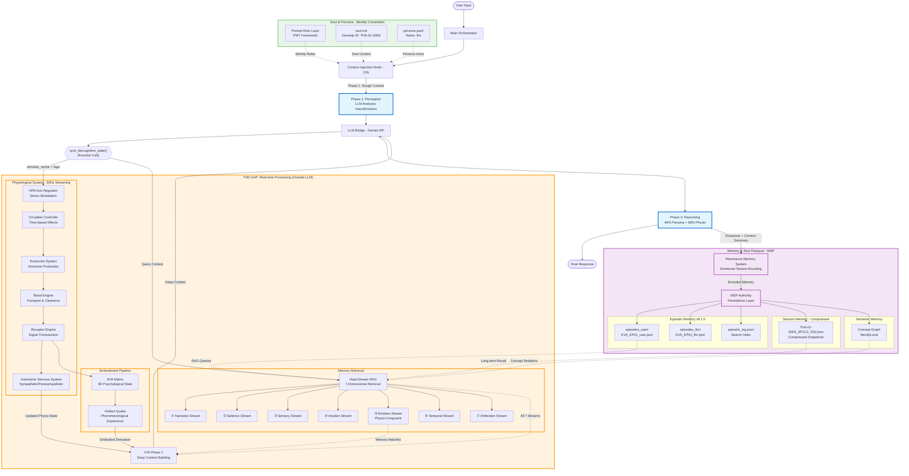

# EVA 8.1.0 System Architecture Map 🗺️

## 1. Conceptual Visualization

---

## 2. Technical Architecture (Mermaid)

## 2. Technical Architecture (Detailed Mermaid)

---

## 3. Layer Definitions

### 🟦 Executive Mind (Tier 1)
- **Main Orchestrator**: The central loop director.
- **CIN (Context Injection Node)**: The dynamic prompt assembler.
- **LLM Bridge**: The cognitive bridge to Gemini/Ollama.

### 🟨 The Gap (Inter-Inference Processing)
- **Physio Core**: Simulates autonomic nervous system and hormones.
- **EVA Matrix**: Map of 9D psychological axes (Stress, Warmth, etc.).
- **Artifact Qualia**: Translates numeric states into descriptive "feelings" for the LLM.
- **RI/RIM**: Evaluates semantic alignment and determines biological impact.

### 🟥 Memory System (Persistence)
- **MSP (Memory & Soul Passport)**: The gatekeeper for episode persistence.
- **Hept Stream RAG**: Ultra-high-fidelity 7-dimensional memory retrieval.
- **Consciousness Store**: Standardized Episodic/Semantic memory storage.

---

## 4. Key Standards
- **Standard**: [MODULE_STRUCTURE_STANDARD.md](file:///E:/The%20Human%20Algorithm/T2/EVA%208.1.0/Operation_System/docs/MODULE_STRUCTURE_STANDARD.md)
- **Compliance**: All 10 core modules are 100% compliant with the 3-Tier standard.
- **Subject**: References to "EVA" now conceptually refer to the **llm** as the subject of experience.
