# EVA 8.1.0 System Architecture Map 🗺️

## 1. Conceptual Visualization

---

## 2. Technical Architecture (Validated Mermaid)

```mermaid
graph TB
    %% User Layer
    UserIn(["User Input"])
    UserOut(["Final Response"])

    %% Orchestration Layer
    Orch["Main Orchestrator"]
    CIN["Context Injection Node - CIN"]
    LLMBridge["LLM Bridge - Gemini API"]

    %% Dual-Phase Loop
    P1["Phase 1: Perception<br/>LLM Analyzes Intent/Emotion"]
    FnCall{{"sync_biocognitive_state()<br/>(Function Call)"}}
    P2["Phase 2: Reasoning<br/>40% Persona + 60% Physio"]

    %% The Gap - Physiological Pipeline
    subgraph Gap ["THE GAP: Real-time Processing (Outside LLM)"]
        direction TB

        subgraph PhysioPipeline ["Physiological System - 30Hz Streaming"]
            HPA["HPA Axis Regulator<br/>Stress Modulation"]
            Circ["Circadian Controller<br/>Time-based Effects"]
            Endo["Endocrine System<br/>Hormone Production"]
            Blood["Blood Engine<br/>Transport & Clearance"]
            Receptor["Receptor Engine<br/>Signal Transduction"]
            ANS["Autonomic Nervous System<br/>Sympathetic/Parasympathetic"]

            HPA --> Circ
            Circ --> Endo
            Endo --> Blood
            Blood --> Receptor
            Receptor --> ANS
        end

        subgraph Embodiment ["Embodiment Pipeline"]
            EVAMatrix["EVA Matrix<br/>9D Psychological State"]
            ArtQualia["Artifact Qualia<br/>Phenomenological Experience"]

            Receptor --> EVAMatrix
            EVAMatrix --> ArtQualia
        end

        subgraph MemRetrieval ["Memory Retrieval"]
            HeptRAG["Hept-Stream RAG<br/>7-Dimensional Retrieval"]

            Stream1["① Narrative Stream"]
            Stream2["② Salience Stream"]
            Stream3["③ Sensory Stream"]
            Stream4["④ Intuition Stream"]
            Stream5["⑤ Emotion Stream<br/>Physio-Congruent"]
            Stream6["⑥ Temporal Stream"]
            Stream7["⑦ Reflection Stream"]

            HeptRAG --> Stream1
            HeptRAG --> Stream2
            HeptRAG --> Stream3
            HeptRAG --> Stream4
            HeptRAG --> Stream5
            HeptRAG --> Stream6
            HeptRAG --> Stream7
        end

        CINPhase2["CIN Phase 2<br/>Deep Context Building"]
    end

    %% Memory Storage Layer
    subgraph MemoryStorage ["Memory & Soul Passport - MSP"]
        RMS["Resonance Memory System<br/>Emotional Texture Encoding"]
        MSP_Auth["MSP Authority<br/>Persistence Layer"]

        subgraph EpisodicMem ["Episodic Memory v8.1.0"]
            EpUser["episodes_user/<br/>EVA_EP01_user.json"]
            EpLLM["episodes_llm/<br/>EVA_EP01_llm.json"]
            EpIndex["episodic_log.jsonl<br/>Search Index"]
        end

        subgraph SessionMem ["Session Memory - Compressed"]
            SesMem["THA-01-S003_SP1C2_SS2.json<br/>Compressed Snapshots"]
        end

        subgraph SemanticMem ["Semantic Memory"]
            SemGraph["Concept Graph<br/>Neo4j/Local"]
        end
    end

    %% Identity Layer
    subgraph IdentityLayer ["Soul & Persona - Identity Constraints"]
        PMT["Prompt Rule Layer<br/>PMT Framework"]
        Soul["soul.md<br/>Develop ID: THA-01-S003"]
        Persona["persona.yaml<br/>Name: EVA"]
    end

    %% Main Flow
    UserIn --> Orch
    Orch --> CIN

    %% Phase 1 Flow
    CIN -->|Phase 1: Rough Context| P1
    PMT -.->|Identity Rules| CIN
    Soul -.->|Soul Context| CIN
    Persona -.->|Persona Voice| CIN

    P1 --> LLMBridge
    LLMBridge --> FnCall

    %% The Gap Trigger
    FnCall -->|"stimulus_vector + tags"| HPA
    FnCall -->|"Query Context"| HeptRAG

    %% The Gap Processing
    ANS -->|Updated Physio State| CINPhase2
    ArtQualia -->|Embodied Sensation| CINPhase2
    Stream5 -.->|Memory Matches| CINPhase2
    HeptRAG -.->|All 7 Streams| CINPhase2

    %% Phase 2 Flow
    CINPhase2 -->|Deep Context| LLMBridge
    LLMBridge --> P2

    %% Output Flow
    P2 --> UserOut

    %% Persistence Flow
    P2 -->|"Response + Context Summary"| RMS
    RMS -->|Encoded Memory| MSP_Auth
    MSP_Auth --> EpUser
    MSP_Auth --> EpLLM
    MSP_Auth --> EpIndex
    MSP_Auth --> SesMem
    MSP_Auth --> SemGraph

    %% Memory Read Flow (Dotted - Read Operations)
    EpUser -.->|RAG Queries| HeptRAG
    SesMem -.->|Long-term Recall| HeptRAG
    SemGraph -.->|Concept Relations| HeptRAG

    %% Styling
    classDef phaseClass fill:#e1f5ff,stroke:#0066cc,stroke-width:3px
    classDef gapClass fill:#fff3e0,stroke:#ff9800,stroke-width:3px
    classDef memClass fill:#f3e5f5,stroke:#9c27b0,stroke-width:2px
    classDef identityClass fill:#e8f5e9,stroke:#4caf50,stroke-width:2px

    class P1,P2 phaseClass
    class Gap,PhysioPipeline,Embodiment,MemRetrieval gapClass
    class MemoryStorage,RMS,MSP_Auth memClass
    class IdentityLayer identityClass
```

---

## 3. Component Overview

### 🎯 Core Orchestration Layer

| Component | Role | Key Responsibility |
|-----------|------|-------------------|
| **Main Orchestrator** | System conductor | Manages dual-phase flow, error handling, logging |
| **Context Injection Node (CIN)** | Dual-phase context builder | **Phase 1**: Rough context (fast) **Phase 2**: Deep context (accurate) |
| **LLM Bridge** | Gemini API integration | Function calling support, bilingual handling |

---

### 🧠 Dual-Phase One-Inference Loop

| Phase | Component | Description | Weighting |
|-------|-----------|-------------|-----------|
| **Phase 1** | Perception | LLM analyzes intent & emotion from user input | N/A (Deterministic trigger) |
| **Function Call** | `sync_biocognitive_state()` | LLM calls function with `stimulus_vector` + `tags` | N/A (Bridge to Gap) |
| **The Gap** | Real-time Processing | Physiological + Memory retrieval (Outside LLM) | 100% embodied processing |
| **Phase 2** | Reasoning | LLM generates response with deep context | **40% Persona + 60% Physio-State** |

**Critical Rule**: This is **ONE LLM inference**, not two separate API calls. The LLM pauses during The Gap and resumes with function result.

---

### ⚡ THE GAP: Real-time Processing (Outside LLM)

#### Physiological Pipeline (30Hz Streaming)

| Component | Input | Output | Role |
|-----------|-------|--------|------|
| **HPA Axis Regulator** | `stimulus_vector` | Modulated stimulus | Stress modulation (HPA Axis) |
| **Circadian Controller** | Modulated stimulus | Time-adjusted stimulus | Circadian rhythm effects |
| **Endocrine System** | Stimulus | Hormone secretion (pg) | Hormone production from glands |
| **Blood Engine** | Hormones (pg) | Blood concentration | Transport, clearance, half-life decay |
| **Receptor Engine** | Blood hormones | Neural signals | Signal transduction (hormones → neural) |
| **Autonomic Nervous System (ANS)** | Neural signals | ANS state (Sympathetic/Para) | Final autonomic integration |

**Pipeline Flow**: `HPA → Circadian → Endocrine → Blood → Receptor → ANS`

#### Embodiment Pipeline

| Component | Input | Output | Role |
|-----------|-------|--------|------|
| **EVA Matrix** | Receptor signals | 9D psychological state | Converts neural signals to 9 dimensions |
| **Artifact Qualia** | EVA Matrix state | Phenomenological experience | Generates qualia for the llm (intensity, tone, coherence, depth) |

#### Memory Retrieval (Hept-Stream RAG)

| Stream | Query Method | Purpose |
|--------|--------------|---------|
| **① Narrative Stream** | Sequential episode chains | Storyline continuity |
| **② Salience Stream** | High RI score | High-impact memories |
| **③ Sensory Stream** | Qualia texture match | Sensory-rich memories |
| **④ Intuition Stream** | Semantic graph patterns | Pattern recognition |
| **⑤ Emotion Stream** | **Physio-congruent match** | **Memories matching current body state** |
| **⑥ Temporal Stream** | Time-based + recency bias | Temporal context |
| **⑦ Reflection Stream** | Meta-cognitive insights | Self-awareness |

---

### 💾 Memory & Soul Passport (MSP)

#### Memory Encoding

| Component | Input | Output | Role |
|-----------|-------|--------|------|
| **Resonance Memory System (RMS)** | LLM response + physio state | Encoded memory structure | Adds emotional texture (core_color, resonance_textures) |

#### Memory Persistence (MSP Authority)

| Collection | Storage Format | Purpose |
|------------|----------------|---------|
| **Episodic Memory (User)** | `episodes_user/` | Lightweight user data for fast RAG queries |
| **Episodic Memory (LLM)** | `episodes_llm/` | Detailed LLM response + full physio trace |
| **Session Memory** | JSON Snapshots | Compressed snapshots (8 sessions → 1 Core) |
| **Search Index** | `episodic_log.jsonl` | Fast keyword/tag search |

---

### 🎭 Identity Layer (Soul & Persona)

| Component | Format | Content | Role |
|-----------|--------|---------|------|
| **Prompt Rule Layer (PMT)** | YAML | Cognitive immunity, Master Blocks | Framework for identity constraints |
| **Soul (Identity)** | Markdown | Develop ID: `THA-01-S003` | Core identity and lineage |
| **Persona** | YAML | Name: `EVA` | Personality, voice, and behavior rules |

---

## 4. System Invariants

1. **One LLM Inference Only**: The LLM pauses during The Gap and resumes with the function result.
2. **Physiology First**: Body state updates before cognitive reasoning (60% weight).
3. **CIN Never Summarizes**: Context summary must come from the LLM in Phase 2.
4. **Context Continuity**: `context_id` (e.g., `ctx_v8_251231_...`) stays constant across both phases.

---

## 5. Performance Goals

| Metric | Target | Notes |
|--------|--------|-------|
| **Total Latency** | ~600ms | Single API call overhead |
| **Memory Sync** | 30Hz | Real-time physiological simulation |
| **I/O Optimization** | 62% Reduction | Using split episodic storage |

---

**Validated Source**: `operation_system/docs/archive/ARCHITECTURE_FLOW_VALIDATED.md`
**Last Updated**: 2026-01-03
**Status**: ✅ **OFFICIAL SYSTEM MAP**
